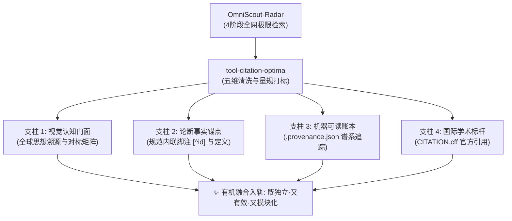

# SPEC-CITATION-PROVENANCE: 全域工程引用、技术溯源与决策依据刚性规范契约

> **标准编号**：AGY-SPEC-2026-CIT-01  
> **制定级别**：全域组织级（Account-Wide Fleet Standard）  
> **生效范围**：全域所有已有仓库（`spec-*`, `tool-*`, `svc-*`, `app-*`）及未来任何通过 `tool-meta-optima` 孵化的新项目  
> **执行引擎**：`tool-citation-optima` & `tool-omniscout-radar`

---

## 🏛️ 第一章：第一性原理与核心宗旨

### 1.1 核心痛点与历史断层
在长期的复杂软件工程与多智能体系统演进中，普遍存在一种**“空中楼阁断层”**：
1. **灵感在讨论中丰富，落地在文档中贫瘠**：在方案讨论推演时，团队或 AI 往往通过搜索引擎进行了大量世界级项目的检索比对，形成了极其深刻的架构见解；
2. **文档结论缺少推导脉络**：但当最终代码与文档沉淀时，往往只保留了生硬的代码片段或简短的 README，**未讲清楚技术方案“怎么来的”、“思想来源是什么”、“对比了世界上哪些现有开源项目与论文”、“为什么选此方案而舍弃其他备选方案”**；
3. **维护者的考古困境**：导致数周之后，新的维护者、外部协作者或后续的 AI 节点面对现有架构时难以理解设计动机，极易随意修改甚至推翻原本经过严密推演的设计。

### 1.2 宗旨与不变量 (The Invariant)
> **“无法证明来龙去脉的架构决策等同于未经论证，无外部对标的技术自嗨等同于重复造轮子。”**  
> 任何项目必须通过全知技术雷达（`tool-omniscout-radar`）与溯源优化引擎（`tool-citation-optima`），将其技术思想来源、权威引用、对标矩阵与非目标边界**显式、有机、可自验地**融合在工程前门体系中。

---

## 🧭 第二章：技术溯源四大有机融合支柱 (The 4 Harmonized Pillars)

针对工程说明文档格式繁多（README, SPEC, DESIGN, ADR, Markdown 等）的异构性难题，严禁生搬硬套死链接或在文末堆砌废料，必须依托四大支柱实现有机融合：



### 支柱 1：全球思想溯源与对标矩阵 (World-Class Heritage & Prior Art Matrix)
* **形式要求**：在项目主文档（README.md 或 核心 SPEC.md）的前门认知层，必须包含高信息密度的 Markdown 对标表格。
* **五大刚性列**：
  1. `权威源流 / 开源基座`：包含官方项目名称、权威 GitHub/DOI/RFC 链接、星数或引用数；
  2. `源流分类`：标注类别（如 `INDUSTRY_STANDARD`, `SPEC_RFC`, `ACADEMIC_PAPER`, `OPEN_SOURCE`）；
  3. `核心思想 / 机制突破`：一句话讲透该外部方案最杰出的首创机制与解决的核心痛点；
  4. `本项目吸收 / 借鉴要点`：实事求是阐明本项目汲取了其哪项关键思想、量规或架构解耦经验；
  5. `超越点与取舍 (Trade-offs)`：一针见血说明**“为何不直接照搬其原有框架”**（如：摆脱臃肿依赖、重构为纯原生标准库、亚毫秒级启动、追求数学级不动点自洽等）。

### 支柱 2：论断事实锚点 (Inline Citations & Footnotes)
* **形式要求**：关键架构设计主张、核心算法、设计模式引入处，必须带有内联角标注记（如 `[^1]`、`[^madr]`），并在章节末尾提供对应的规范定义；
* **底线原则**：严禁伪造虚假域名（如 `example.com`、`placeholder`）或失效的锚点，所有链接必须指向真实可访问的权威资源。

### 支柱 3：机器可读元数据账本 (`.provenance.json`)
* **形式要求**：在工程根目录生成 JSON 格式的谱系账本；
* **内容涵盖**：
  * `search_topic`: 当时在技术雷达中执行检索的原始主题；
  * `radar_query_vectors`: 检索时使用的正交向量；
  * `grounded_sources`: 权威源流元数据阵列；
  * `architectural_invariants`: 本工程的核心不变量；
  * `alternatives_considered`: 被评估过但舍弃的备选方案列表及原因；
  * `non_goals`: 坚决不做的事。

### 支柱 4：国际开源学术标杆 (`CITATION.cff`)
* **形式要求**：遵循 Citation File Format v1.2.0 规范，放置于工程根目录；
* **效果**：使工程推送到 GitHub 后原生激活右侧工具栏的 **"Cite this repository"** 按钮，便于学术界与工业界标准化引用。

---

## 📊 第三章：五维客观严密审计量规 (Five-Dimensional Rubric)

由 `tool-citation-optima audit` 自动化执行，满分 100 分。**严禁主观随意打标，严格实行量化客观验真**：

| 维度编号 | 维度名称 | 满分 | 判定及扣分细则 | 达标期望 (S级) |
| :--- | :--- | :---: | :--- | :--- |
| **D1** | **思想溯源与全球对标矩阵** | 20分 | 无表格得 0 分；表格空有表头得 5 分；对标条目 1~2 项得 12 分；完整对标 $\ge 3$ 项权威项目得 20 分。 | $\ge 3$ 项全球权威对标，含 Trade-off 说明 |
| **D2** | **内联引用与脚注佐证** | 20分 | 无内联注记得 0 分；有注记但无定义得 12 分；注记与定义完备 ($\ge 3$ 处) 得 20 分。 | 核心决断均有 `[^id]` 与文末权威出处 |
| **D3** | **机器可读元数据完备度** | 20分 | 具有 `.provenance.json` 得 12 分；具有 `CITATION.cff` 得 8 分；两项兼备得 20 分。 | 两项机器账本 100% 配置且数据自洽 |
| **D4** | **架构推导依据与备选舍弃** | 20分 | 既无 Non-Goals 又无备选对比得 0 分；仅具备其一得 12 分；两项均详尽阐述得 20 分。 | 明确 Non-Goals 与 Alternatives Considered |
| **D5** | **链接真实性与抗空壳防腐** | 20分 | **[一票否决/水军截断]** 若项目为无实质可运行代码的纯文档空壳，**总分强制死锁截断在 45 分以下 (F级)**；若存在 placeholder 虚假链接扣至 5 分；链接权威真实且代码健壮得 20 分。 | 真实代码实体 + 真实外链 |

### 评级体系与收敛定义
* **S 级 (90~100分) - 登峰造极 (Fixed-Point Master)**：完全收敛，具备数学级不动点自洽性 $f(x)=x$；
* **A 级 (80~89分) - 规范卓越**：溯源基本完备，具备高信噪比；
* **B 级 (70~79分) - 基本合格**：存在部分要素缺漏；
* **C 级 (60~69分) - 欠缺依据**：缺少对标或决策依据模糊；
* **F 级 (<60分) - 空中楼阁**：触犯形式主义空壳红线或缺少溯源基础。

---

## ⚡ 第四章：与其他工具与规范的拓扑协同

```text
       [spec-omni-project] (顶层母港规范)
              │
              ├──► [tool-omniscout-radar] (底层全网探针与四阶段雷达检索)
              │           │
              │           ▼ (产出雷达审计 JSON 档案)
              │    [tool-citation-optima] (本规范执行引擎: 提纯/打标/有机注入)
              │           │
              ├──► [tool-meta-optima] (三阶导自举与入轨孵化器)
              │           │ (在 init/onboard 时调用本引擎注入溯源底座)
              │           ▼
              └──► [未来任意新建或吸收入轨的独立项目 (N+1, N+2...)]
```

1. **协同 `tool-omniscout-radar`**：
   - 雷达负责“找”（全网爬取、动态本体合成、拓扑滚雪球）；
   - 本工具负责“炼与化”（清洗去噪、五维量规审计、生成机器账本、非破坏性有机注入文档）。
2. **协同 `tool-meta-optima`**：
   - 当使用 `ProjectIncubator` 孵化新工程（`python main.py init`）或对外部工程吸收入轨（`python main.py onboard`）时，调用本工具的 `init-cff` 与对标注入能力，出厂即达成引用合规。
3. **协同 GitHub Actions (`Longgekutta/.github`)**：
   - 本工具内置 `.github/workflows/ci.yml`，直接复用中央矩阵工作流进行跨平台 Windows + Ubuntu 验证。

---

## 🚀 第五章：命令行操作标准操典

任何开发者或 AI 智能体可直接在命令行调度：
```powershell
# 1. 对指定工程进行引用与技术溯源审计
python D:\gitee\tool-citation-optima\main.py audit <目标工程路径>

# 2. 联动 omniscout-radar 进行极限搜索并有机融合注水
python D:\gitee\tool-citation-optima\main.py ground <目标工程路径> --topic "<检索主题>"

# 3. 验证数学级不动点收敛
python D:\gitee\tool-citation-optima\main.py fixed-point <目标工程路径>
```
